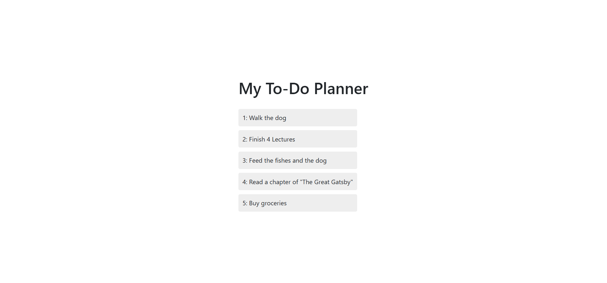

# 📝 PromptPlan

**PromptPlan** is a minimal yet interactive browser-based to-do list app that mimics a CLI-like experience using JavaScript's `prompt()` method.  
Tasks are displayed live on the page and can be removed by clicking on them. Styled with Bootstrap and custom CSS for a clean look.

---

## Screenshot

### PromptPlan Preview


---

## Features

- Add tasks via prompt
- View tasks in a live list
- Click to delete tasks
- Command-based interaction (`new`, `list`, `delete`, `quit`)
- Stylish UI with Bootstrap & custom CSS

---

## Tech Stack

- HTML5
- CSS3
- Bootstrap 5
- JavaScript (ES6)

---

## Getting Started

1. **Clone the repository:**
    ```bash
    git clone https://github.com/Misba0019/PromptPlan.git
    ```

2. **Open the `ToDo_List.html` file in your preferred web browser.**

---

## Contributing

Contributions are welcome! Feel free to fork the repository and submit a pull request.

---

## Credits

- [Bootstrap](https://getbootstrap.com/)
- [Google Fonts](https://fonts.google.com/)

---

## License

This project is licensed under the MIT License - see the [LICENSE](LICENSE) file for details.